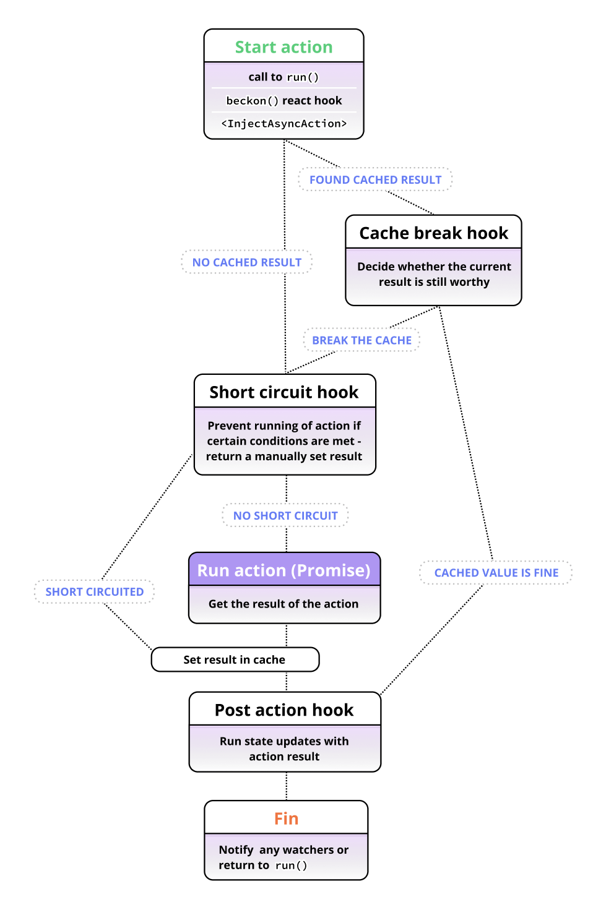

The second argument while creating Async Actions allows us to pass hooks for the action:

```tsx
const searchPicturesForTag = createAsyncAction(async ({ tag }) => {
  // action code
}, hooksGoHere);
```

This `hooksGoHere` object has three hook types which we can set for this action, as follows:

```tsx
{
  postActionHook,
  shortCircuitHook,
  cacheBreakHook
}
```

## Async hooks flow diagram

To try and give you a quick overview of how actions work with hooks, lets look at a top-down flow diagram of an Async Action's execution:



## Quick overview of each

### `postActionHook({ args, result, stores, context })`

Post action hook is for consistently running state updates after an action completes for the first time or hits a cached value.

Read more on the [post action hook](async-post-action-hook.md).

### `shortCircuitHook({ args, stores })`

The short circuit hook is for checking the current state of your app and manually deciding that an action does not actually need to be run, and returning a replacement resolved value yourself.

Read more on the [short circuit hook](async-short-circuit-hook.md).

### `cacheBreakHook({ args, result, stores, timeCached })`

This hook is run only when an action has already resolve at least once. It takes the currently cached value and decides whether we should "break" the cache and run the action again instead of returning it.

Read more on the [cache break hook](async-cache-break-hook.md).

---

**NOTE:** In all these hooks, `stores` is only available when you are doing server rendering and you have used your centralized Pullstate "Core" to create your Async Actions, and are making use of `<PullstateProvider>` (see the server-rendering part [Creating an Async Action](async-actions-creating.md)). If you have a client-side only app, just import and use your stores directly.
